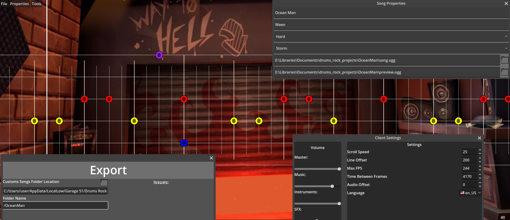

# Demon Forge; A Drums Rock Editor

A custom song editor for Drums Rock that supports editing and previewing charts.

# Installation

Download the .exe from [releases](https://github.com/daredevil28/DemonForge/releases) and run it, no further configuration required

# Usage

- Make sure that your audio is snapped properly first in a program like Audacity [Tutorial](https://steamcommunity.com/sharedfiles/filedetails/?id=2989549859)
- Put all your files (song.ogg, preview.ogg) in 1 folder for save keeping
- Press new file (File > New File)
- Set up all the right data in Properties > Song Properties
- Go to File > Save File to save a .json of your chart
- Place notes by left clicking on the chart, remove notes by right clicking on a note. You can change drum roll intervals by left clicking on a note and changing the interval on the bottom left
- When you made your entire chart go to File > Export project
- Make sure that the custom folder location is right
- Put a name for the folder where the program will put your files in the custom songs folder
- Fix any issues that it's screaming about
- Test your chart in the game
- If your chart has a mistake, fix the mistake in the program and press export again, it will overwrite the files

# Custom assets

In order to make your custom assets work, you have to do the following:
1. Make a new folder next to the executable called `custom`
2. name the files appropiately like this:
- `note.png`
- `marker.png`
- `background.png`
- `background.jpg`
- `snare.wav` (yellow note)
- `kick.wav` (red note)
- `tomhigh.wav` (Orange note)
- `tomlow.wav` (Purple note)
- `crash.wav` (Blue note)
- `ride.wav` (Green note)
3. Start the application, the custom assets should now be loaded in

You can also download the files directly in the [custom](custom) folder

# Future features

- [x] Visualise the notes in sync with the music
- [x] Save charts in a custom json format
- [x] Read the original game format (.csv)
- [x] Editing charts inside the application
- [x] Figure out how to properly play sound for drum rolls
- [x] Snap editing
- [x] Adjustable client settings (scroll speed, note size,volume etc)
- [x] Custom asset support for audio/sprites
- [x] Undo/Redo button
- [x] Support other timing signatures
- [x] Support dynamic time signatures and bpm
- [ ] Set preview time stamp and length to automatically export preview
- [x] Export project to the custom songs folder
- [x] Audio offset for syncing up audio

# Compiling

Development version is Godot v4.4-dev6.

- Import project into godot
- Project > Export
- Select Your OS
- Press export project

The executable should be exported into ProjectFolder/Build/*

# Possible future features

* Drum track seperation with something like [OpenVINO](https://github.com/openvinotoolkit/openvino)

# Contributing

Other than fixing some bugs I am currently not accepting contributions until I at least finish the editing part of the application
